# Mutual Fund Analytics Platform

## Project Overview

The Mutual Fund Analytics Platform was developed to analyze mutual fund performance, investor behavior, portfolio trends, and risk-adjusted returns using Python, SQL, SQLite, and Power BI.

---

## Objectives

- Analyze mutual fund performance
- Evaluate investor transactions
- Measure risk-adjusted returns
- Build fund recommendation models
- Create interactive dashboards

---

## Data Sources

Datasets Used:

- Scheme Performance
- Investor Transactions
- Portfolio Holdings
- Benchmark Indices
- Industry Folio Counts
- NAV History

Total Schemes Analyzed: 40+

Total Transactions: 25,000+

---

## ETL Pipeline

Steps:

1. Data Ingestion
2. Data Cleaning
3. Data Validation
4. SQLite Database Creation
5. Dashboard Integration

Tools:

- Python
- Pandas
- SQLite

---

## Exploratory Data Analysis

Analysis Performed:

- Age Distribution
- Gender Distribution
- State Analysis
- KYC Status
- Payment Mode Analysis
- Category Distribution

Generated Visualizations:

- age_distribution.png
- gender_distribution.png
- state_distribution.png
- category_distribution.png

---

## Performance Analytics

Metrics Calculated:

- Sharpe Ratio
- Sortino Ratio
- Alpha
- Beta
- Maximum Drawdown

Generated Outputs:

- alpha_beta.csv
- top_sharpe.png

---

## Advanced Analytics

Implemented:

### VaR & CVaR

Measured downside risk using historical return distributions.

### Investor Cohort Analysis

Grouped investors by joining year.

### SIP Continuity Analysis

Identified at-risk investors based on SIP transaction gaps.

### Fund Recommendation Engine

Generated fund recommendations using:

- Return
- Sharpe Ratio
- Expense Ratio

Generated Outputs:

- var_cvar_report.csv
- top_fund_preference.csv
- rolling_sharpe_chart.png
- top_recommended_funds.png

---

## Dashboard Development

Created 4 Dashboard Pages:

1. Industry Overview
2. Fund Performance
3. Investor Analytics
4. SIP & Market Trends

Features:

- KPI Cards
- Drill-through
- Interactive Filters
- Dynamic Visualizations

---

## Key Insights

1. Small Cap funds achieved the highest recommendation scores.
2. Investor cohort 2024 contributed the largest investment volume.
3. Majority of SIP investors were classified as At Risk.
4. Risk-adjusted returns varied significantly across fund categories.
5. VaR/CVaR analysis identified high-risk schemes.

---

## Conclusion

The platform provides end-to-end mutual fund analytics covering ETL, EDA, performance measurement, risk analysis, recommendation systems, and dashboard reporting.
## Exploratory Data Analysis

### Age Distribution
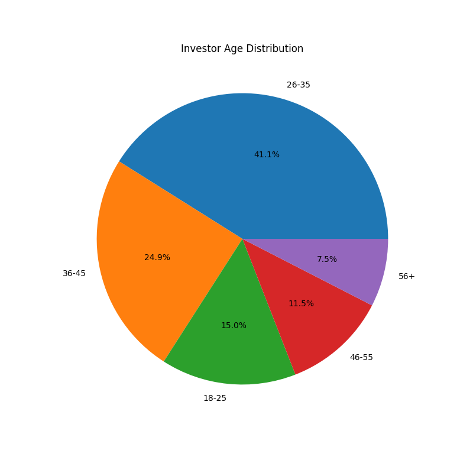

### Gender Distribution
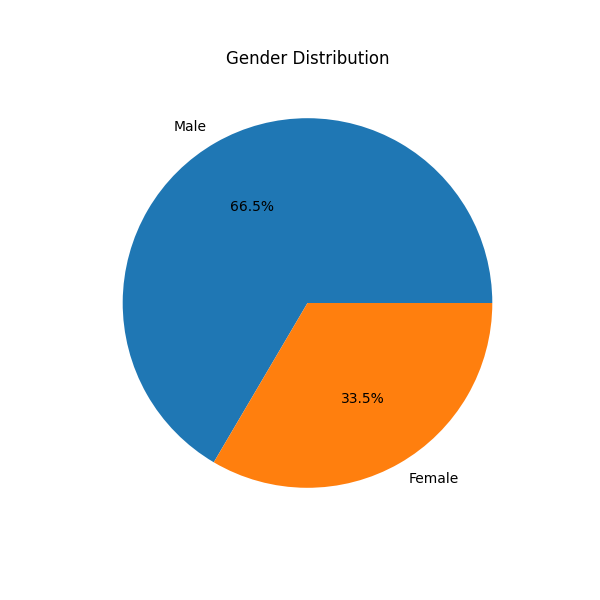

### Risk Grade Distribution
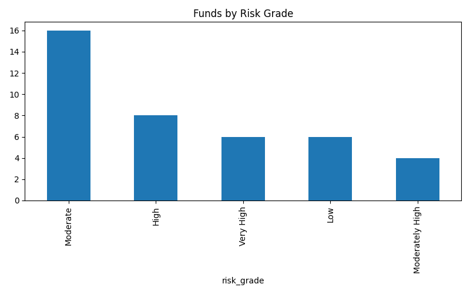

---

## Performance Analytics

### Risk vs Return
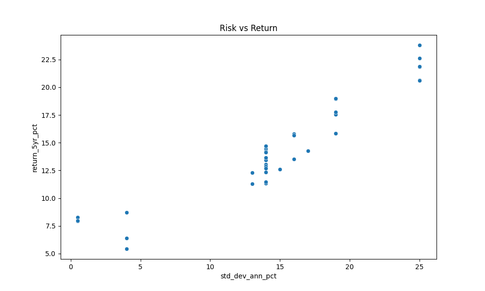

### Top Sharpe Ratio Funds
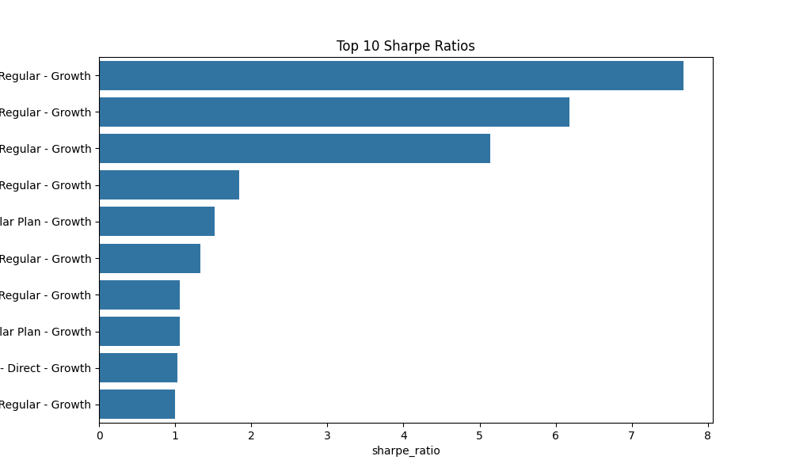

### Benchmark Comparison

---

## Advanced Analytics

### Rolling Sharpe Ratio
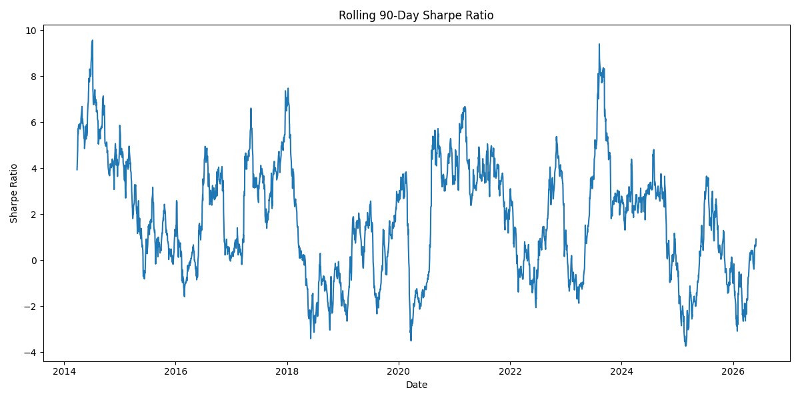

### Fund Recommendations
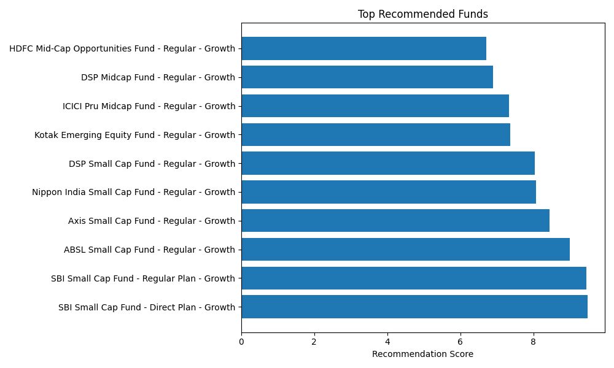
## Power BI Dashboard

### Industry Overview
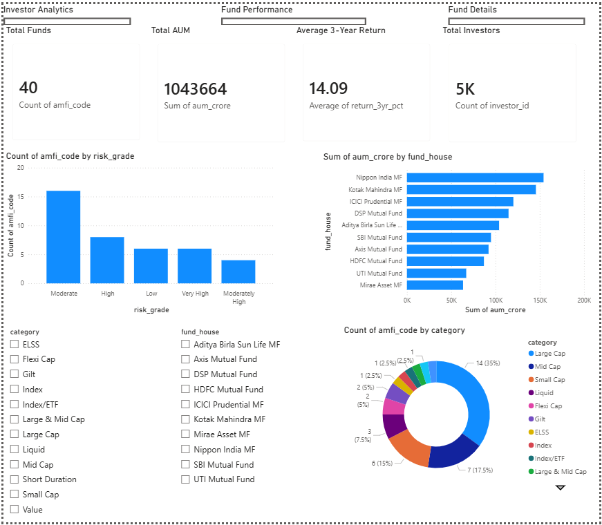

### Fund Performance
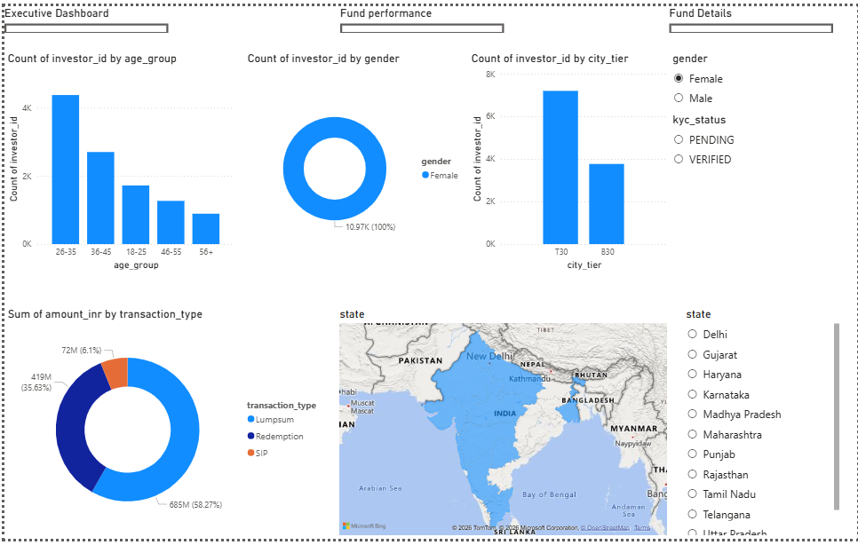

### Investor Analytics
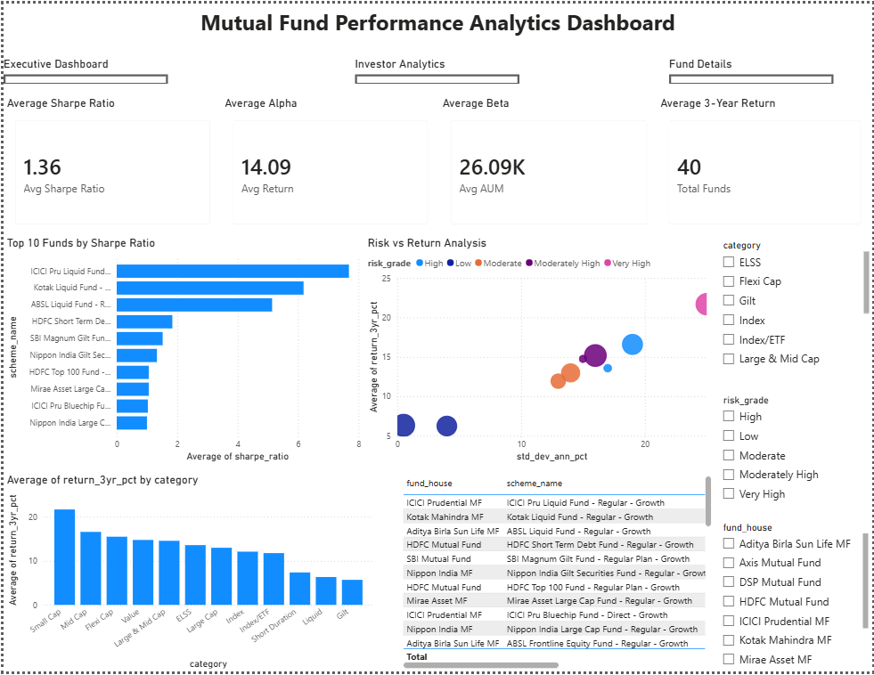

### SIP & Market Trends
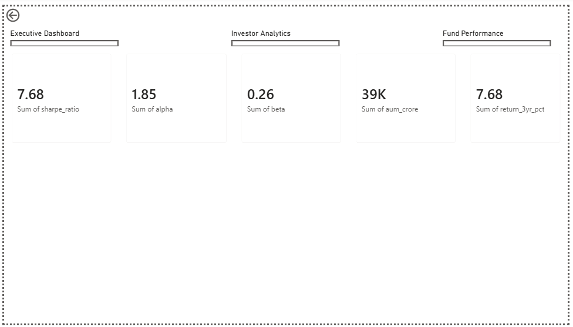